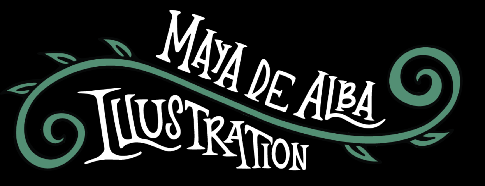

# Maya de Alba Illustration — Portfolio Website Mind Map
> **For Claude Code:** Read this file at the start of every session. It is the single source of truth for architecture, design decisions, feature specs, and open TODOs.

---

## 0. Project Overview

| Field | Value |
|---|---|
| **Owner** | Maya Angela de Alba |
| **Type** | Illustrator portfolio (student, BFA at SCAD) |
| **Hosting** | GitHub Pages via GitHub Actions |
| **Repo structure** | Static site — no server-side framework |
| **Build** | Plain HTML/CSS/JS (no bundler required) OR a minimal static-site generator if complexity warrants it |
| **Deployment trigger** | Push to `main` → GitHub Action builds & deploys to `gh-pages` branch |
| **Primary goal** | Showcase illustration, surface design, and motion work to potential clients / employers |

---

## 1. Visual Identity & Design System

### 1.1 Aesthetic Direction
- **Theme:** Dark, magical, handcrafted — matching the ornate vine-and-scroll logo
- **Background:** Near-black (`#0a0a0a` or true `#000`) as the canvas for most pages; sub-pages (detail pages) shift to white/light for readability
- **Mood:** Whimsical, slightly gothic, studio-artisan. Think illuminated manuscripts meets modern illustration portfolio.

### 1.2 Color Palette (CSS Variables)
```css
--color-bg:          #090909;
--color-bg-light:    #ffffff;
--color-surface:     #141414;
--color-accent:      #2e8b6e;   /* teal-green pulled from logo swirls */
--color-accent-warm: #c96a2b;   /* warm amber for hover states */
--color-text:        #f0ede8;   /* warm off-white */
--color-text-muted:  #7a7570;
--color-border:      rgba(255,255,255,0.08);
```

### 1.3 Typography
- **Display / Logo wordmark:** Custom image (SVG or PNG) — do NOT attempt to recreate in CSS
- **Headings:** A serif or display typeface with personality — e.g., `"Playfair Display"` or `"Cormorant Garamond"` (Google Fonts, free)
- **Body / Nav:** A clean humanist sans — e.g., `"DM Sans"` or `"Outfit"` (avoid Inter/Roboto)
- **Accent / Labels:** Small caps or tracking-wide uppercase for category labels

### 1.4 Motion Principles
- Page entrance: fade-in + subtle upward translate (`opacity 0→1`, `translateY 20px→0`, ~400ms ease-out)
- Hover on art cards: slight scale-up (`scale(1.03)`) + shadow deepens
- Surface-design card flip: CSS 3D transform (`rotateY 180deg`) on hover, revealing white face with title text
- Lightbox open/close: backdrop fades in; image scales from 90%→100%
- Scroll reveal on detail pages: `IntersectionObserver` — images slide up as they enter viewport
- Cursor: default system cursor (keep clean, no custom cursor needed)

---

## 2. Site Architecture

```
/
├── index.html              ← Home page
├── illustration.html       ← Illustration gallery
├── surface-design.html     ← Surface Design gallery (card grid)
├── surface-detail.html     ← Surface Design detail page (dynamic via URL param)
├── motion.html             ← Motion page (placeholder / embed videos)
├── about.html              ← About & Contact page
│
├── assets/
│   ├── css/
│   │   ├── reset.css
│   │   ├── variables.css   ← all CSS custom properties
│   │   ├── global.css      ← header, nav, footer, typography base
│   │   ├── home.css
│   │   ├── illustration.css
│   │   ├── surface.css
│   │   ├── detail.css
│   │   └── about.css
│   ├── js/
│   │   ├── nav.js          ← active link highlighting, mobile menu
│   │   ├── lightbox.js     ← illustration fullscreen viewer
│   │   ├── surface.js      ← card hover flip + click routing
│   │   ├── detail.js       ← scroll reveal + data loading
│   │   └── data.js         ← all portfolio content as JS objects (images added later)
│   └── images/
│       ├── logo.png (or .svg)
│       └── [artwork files added by Maya]
│
└── .github/
    └── workflows/
        └── deploy.yml      ← GitHub Actions: build & deploy to gh-pages
```

---

## 3. GitHub Actions Deploy Workflow

**File:** `.github/workflows/deploy.yml`

```yaml
name: Deploy to GitHub Pages
on:
  push:
    branches: [main]
jobs:
  deploy:
    runs-on: ubuntu-latest
    permissions:
      contents: write
    steps:
      - uses: actions/checkout@v4
      - name: Deploy
        uses: peaceiris/actions-gh-pages@v4
        with:
          github_token: ${{ secrets.GITHUB_TOKEN }}
          publish_dir: ./        # root of repo IS the site (no build step)
          publish_branch: gh-pages
```

> **Note:** If a build step (Sass, etc.) is added later, change `publish_dir` accordingly.

---

## 4. Page-by-Page Specifications

---

### 4.1 Home Page (`index.html`)

**Layout (top → bottom):**
1. **Header / Nav** *(shared component, see §5)*
2. **Hero Carousel / Slideshow**
   - Three panels visible simultaneously on desktop (left partial, center full, right partial)
   - Auto-advances every ~4s; manual prev/next arrows on far edges
   - Images fill panels edge-to-edge (object-fit: cover)
   - On mobile: single panel, swipe gesture support
3. **"Hello!" Bio Section**
   - Left: large bold `Hello!` heading + 2–3 sentence intro paragraph + "About Me" CTA button
   - Right: rounded photo of Maya drawing (portrait orientation, `border-radius: 24px`)
   - Layout: 50/50 grid on desktop, stacked on mobile (photo below text)
4. **Footer** *(shared component, see §5)*

**Data needed:** 3 hero images (filenames in `data.js`), bio text, photo filename

---

### 4.2 Illustration Page (`illustration.html`)

**Layout:**
- 3-column masonry/grid of artwork thumbnails
- On mobile: 2 columns → 1 column
- Each image: no caption on hover (keep clean), cursor becomes pointer
- Clicking an image opens the **Lightbox**

**Lightbox behavior:**
- Backdrop: semi-transparent black overlay (`rgba(0,0,0,0.85)`)
- Image centered, max 90vw × 90vh, with `border-radius: 4px`
- Close button: `×` top-right corner
- Left / Right arrow buttons to navigate through the gallery without closing
- Click outside image OR press `Escape` closes lightbox
- Opening animation: backdrop fades in (200ms), image scales 90%→100% (300ms)
- Closing: reverse animation

**Data:** Array of illustration image objects in `data.js`:
```js
// data.js
const illustrations = [
  { id: 'macabre',    src: 'assets/images/macabre.jpg',    alt: 'Macabre composition with skeleton and botanical elements' },
  { id: 'moonlit',   src: 'assets/images/moonlit.jpg',    alt: 'Figure beneath full moon in a fairytale forest' },
  { id: 'firebird',  src: 'assets/images/firebird.jpg',   alt: 'Firebird / Zhar-Ptitsa folk illustration' },
  // ... etc
];
```

---

### 4.3 Surface Design Page (`surface-design.html`)

**Layout:**
- 3-column grid of **flip cards**
- Each card: rounded rectangle (`border-radius: 20px`), portrait orientation (~280×380px on desktop)
- **Card Front:** artwork pattern fills the entire card face (object-fit: cover)
- **Card Back (on hover):** white background, project title in large bold serif, optional 1-line tagline
- **On click:** navigates to `surface-detail.html?id=<project-id>`

**Flip card CSS mechanics:**
```
.card-wrapper  → perspective: 1000px
.card          → transform-style: preserve-3d; transition: transform 0.5s ease
.card:hover    → transform: rotateY(180deg)
.card-front    → backface-visibility: hidden
.card-back     → backface-visibility: hidden; transform: rotateY(180deg)
```

**Data:** Array of surface design project objects in `data.js`:
```js
const surfaceProjects = [
  {
    id: 'medieval-fairytale',
    title: 'Medieval Fairytale',
    tagline: 'Medieval history, art, and culture with a mix of fantasy',
    thumbnail: 'assets/images/surface/medieval-thumb.jpg',
    description: 'A personal pattern project based on my favorite things: Medieval history, art, and culture with a mix of fantasy!',
    images: [
      'assets/images/surface/medieval-motifs-green.jpg',
      'assets/images/surface/medieval-motifs-orange.jpg',
      'assets/images/surface/medieval-pattern-orange.jpg',
      'assets/images/surface/medieval-pattern-green.jpg',
    ],
    processDescription: 'I often start my projects by creating three different themes with various motifs for each. After landing on a theme, I move forward with refining my sketch and doing my linework traditionally with ink. I then color everything digitally and create my patterns with Adobe Illustrator!',
    processImages: [
      'assets/images/surface/medieval-process-sketch.jpg',
      'assets/images/surface/medieval-process-ink.jpg',
    ],
    mockupImages: [
      'assets/images/surface/medieval-mockup-fabric.jpg',
    ]
  },
  // ... more projects
];
```

---

### 4.4 Surface Design Detail Page (`surface-detail.html`)

**URL pattern:** `surface-detail.html?id=medieval-fairytale`

**Layout (top → bottom):**
1. **Shared Header / Nav**
2. **Project Header** (white/light background section)
   - Large bold `<h1>` project title
   - Subtitle / description paragraph (bold)
3. **Image Gallery** — full-width two-column grid
   - Images load progressively with **scroll reveal**
   - Each image: `IntersectionObserver` triggers `opacity 0→1` + `translateY 40px→0` at ~0.15 threshold
   - Images are large (no thumbnails here — full art display)
4. **Process Work Section**
   - `<h2>Process Work</h2>`
   - Two-column layout: left = process description text, right = process photo (ink drawing photo)
   - Below: sketch/thumbnail overview image
5. **Mockup / Application Section** *(optional, show if mockup images exist)*
   - Images of patterns applied to real products (fabric swatch, wrapping paper, etc.)
6. **← Back to Surface Design** navigation link at bottom

**JavaScript logic:**
```js
// detail.js
const params = new URLSearchParams(window.location.search);
const projectId = params.get('id');
const project = surfaceProjects.find(p => p.id === projectId);
// inject project data into DOM
// then set up IntersectionObserver for scroll reveal
```

---

### 4.5 Motion Page (`motion.html`)

**Current state:** Placeholder — can embed YouTube/Vimeo iframes or show a "coming soon" styled message

**Layout:**
- Header/nav
- Grid of video embeds (responsive iframes, 16:9 aspect ratio)
- Or: styled "Coming Soon" message with Maya's email CTA

---

### 4.6 About & Contact Page (`about.html`)

**Layout (top → bottom):**
1. **Header / Nav**
2. **About Section** (dark background)
   - Left: bio text (longer version of homepage intro)
   - Right: photo of Maya
3. **Contact Section** (can stay dark or shift to slightly lighter surface)
   - `<h2>Get in Touch</h2>`
   - Email address (linked with `mailto:`)
   - Instagram link
   - Optional: simple contact form (HTML only, submits via Formspree or Netlify Forms)
4. **Footer**

---

## 5. Shared Components

### 5.1 Header & Navigation

**Structure:**
```html
<header class="site-header">
  <a href="index.html" class="logo-link">
    
  </a>
  <nav class="site-nav">
    <a href="index.html">Home</a>
    <a href="illustration.html">Illustration</a>
    <a href="surface-design.html">Surface Design</a>
    <a href="motion.html">Motion</a>
    <a href="about.html">About & Contact</a>
  </nav>
  <button class="nav-toggle" aria-label="Toggle navigation">☰</button>
</header>
```

- Active page link gets an underline / slight color highlight (set by `nav.js` based on `window.location.pathname`)
- Mobile: hamburger button → slides down nav links
- Logo: centered on mobile, left-aligned on desktop (or always centered as seen in screenshots)

### 5.2 Footer

**Structure:**
```html
<footer class="site-footer">
  <p>© 2025 Maya Angela de Alba</p>
  <nav class="footer-nav">
    <a href="mailto:maya@example.com">EMAIL</a>
    <span>|</span>
    <a href="https://instagram.com/..." target="_blank">INSTAGRAM</a>
  </nav>
</footer>
```

- Footer background: white / light on dark pages acts as transition
- Text: small, uppercase, tracked

---

## 6. Responsive Breakpoints

| Breakpoint | Width | Grid columns |
|---|---|---|
| Mobile | < 640px | 1 col (illustration), 1 col (surface) |
| Tablet | 640–1024px | 2 col |
| Desktop | > 1024px | 3 col |

- Navigation collapses to hamburger at < 768px
- Hero panels: 3 visible on desktop, 1 on mobile

---

## 7. `data.js` — Content Management

All editable content lives in `assets/js/data.js`. Maya adds new projects or images here without touching HTML.

```js
// assets/js/data.js

const siteData = {
  owner: "Maya Angela de Alba",
  email: "maya@example.com",           // REPLACE
  instagram: "https://instagram.com/", // REPLACE
  bio: {
    short: "My name is Maya Angela de Alba and I am an illustrator currently pursuing a BFA at the Savannah College of Art and Design.",
    long:  "..."
  },
  heroImages: [
    { src: 'assets/images/hero/hero1.jpg', alt: '...' },
    { src: 'assets/images/hero/hero2.jpg', alt: '...' },
    { src: 'assets/images/hero/hero3.jpg', alt: '...' },
  ],
  illustrations: [ /* see §4.2 */ ],
  surfaceProjects: [ /* see §4.3 */ ],
};
```

---

## 8. Accessibility & SEO Checklist

- [ ] All images have descriptive `alt` attributes
- [ ] Semantic HTML: `<header>`, `<nav>`, `<main>`, `<section>`, `<footer>`
- [ ] Focus-visible states on all interactive elements
- [ ] Lightbox traps focus while open; restores focus on close
- [ ] `<title>` and `<meta name="description">` on each page
- [ ] Open Graph tags on `index.html` (for social sharing)
- [ ] Color contrast: all text meets WCAG AA on both dark and light backgrounds
- [ ] Keyboard navigation: lightbox closeable with `Escape`, arrows work with keyboard

---

## 9. GitHub Actions Notes

- The `deploy.yml` workflow triggers on every push to `main`
- No build step needed (pure static files)
- GitHub Pages will serve from `gh-pages` branch
- Set the repo's Pages source to `gh-pages` branch in **Settings → Pages**
- Custom domain: add a `CNAME` file in the repo root if Maya gets a custom domain later
- All asset paths must be **relative** (not absolute) so they work both locally and on GitHub Pages

---

## 10. Open TODOs / Future Enhancements

- [ ] Add real images once Maya provides them (drop in `assets/images/`, update `data.js`)
- [ ] Replace placeholder email in `data.js`
- [ ] Replace placeholder Instagram URL in `data.js`
- [ ] Motion page content (video embeds or animations)
- [ ] Consider adding a simple contact form via Formspree (free tier)
- [ ] Add `loading="lazy"` to all `` tags once images are present
- [ ] Optimize images: compress JPGs to ~80% quality, use WebP where possible
- [ ] Add `prefers-reduced-motion` media query to disable animations for accessibility
- [ ] Light/dark mode toggle (optional stretch goal)
- [ ] Print stylesheet for about/contact page

---

## 11. File Naming Conventions

- HTML pages: `kebab-case.html`
- CSS files: `kebab-case.css`
- JS files: `camelCase.js` or `kebab-case.js`
- Image files: `kebab-case.jpg` / `.png` / `.svg`
- All filenames: **lowercase**, no spaces

---

## 12. Quick Reference — Key Design Decisions

| Decision | Choice | Reason |
|---|---|---|
| Framework | Vanilla HTML/CSS/JS | No build step; easiest to host on GitHub Pages; no dependencies |
| CSS architecture | Custom properties + per-page sheets | Lightweight, maintainable without a preprocessor |
| Card flip | CSS 3D transform (pure CSS) | No JS needed; smooth 60fps |
| Scroll reveal | `IntersectionObserver` | No library dependency; native browser API |
| Lightbox | Custom JS (no library) | Small codebase, full control over animation |
| Content data | `data.js` object | Single place for Maya to add artwork without editing HTML |
| Fonts | Google Fonts (Playfair Display + DM Sans) | Free, reliable CDN, offline fallback stacks defined |
| Deployment | GitHub Actions → gh-pages | Free, automated, version-controlled |
